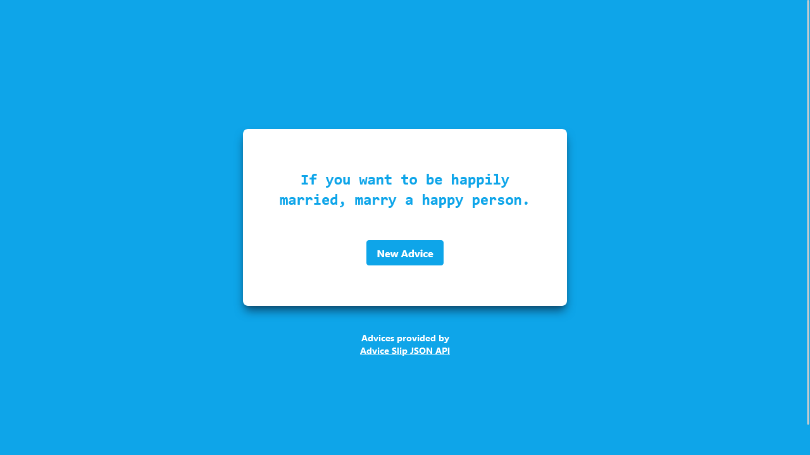
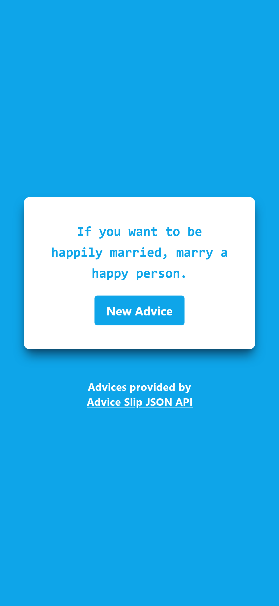

# React.js Random Quote/Advice Machine

If you feel lost in life, you can always use this random generator of tips to get back on track.

## Link

Go see the Random Machine in action [here](https://my-reactjs-random-quotes.vercel.app/)

## Features

- A random advice
- Button to request new advice
- Responsive design

## Screenshots

### Desktop View

### Mobile View

## Built with

- [React.js](https://reactjs.org/)
- [TailwindUI](https://tailwindui.com/)
- [Advice Slip JSON API](https://api.adviceslip.com/)

## Run locally

1. Clone this repo
2. Run `npm install`
3. Run `npm run start` or `npm start`
4. Open the application in `http://localhost:3000/` or any available port
